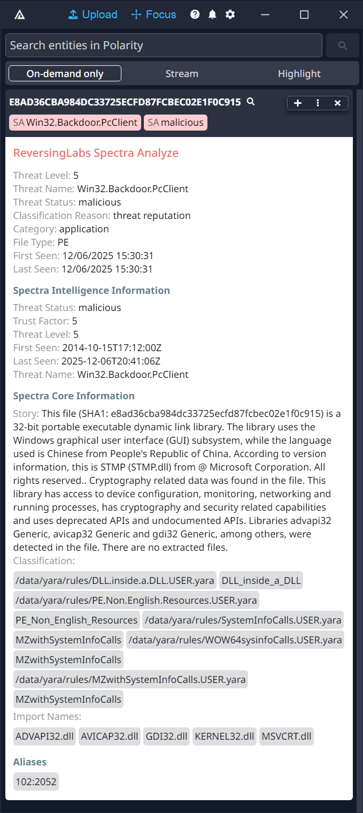

# Polarity ReversingLabs Spectra Analyze Integration

Polarity's ReversingLabs Spectra Analyze integration gives users access to automated MD5, SHA1, SHA256 lookups within ReversingLabs Spectra Analyze system.

ReversingLabs is a world leader in file reputation and analysis with over 3.2 billion files analyzed to date. To get more information on ReversingLabs, please visit www.reversinglabs.com

|             | 
|----------------------------------------|
| *ReversingLabs Spectra Analyze details* |

## ReversingLabs Integration Options

### ReversingLabs' Spectra Analyze URL

Spectra Analyze Server URL which should include the schema (i.e., https://) and port if required. Defaults to the cloud instance at "https://a1000.reversinglabs.com"

### Username

ReversingLabs Spectra Analyze Username

### Password

ReversingLabs Spectra Analyze password for the provided Username

## Installation Instructions

Installation instructions for integrations are provided on the [PolarityIO GitHub Page](https://polarityio.github.io/).

## Polarity

Polarity is a memory-augmentation platform that improves and accelerates analyst decision making.  For more information about the Polarity platform please see:

https://polarity.io/
